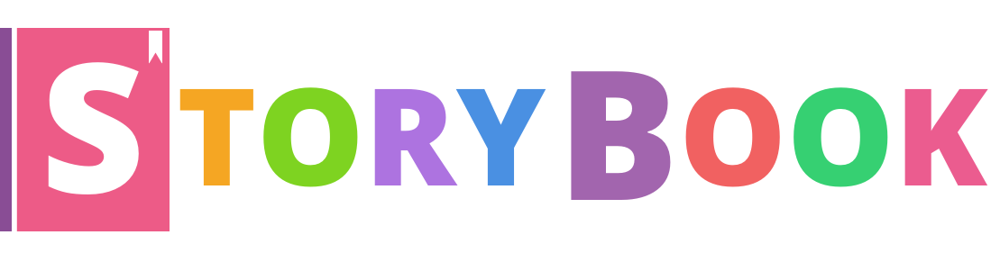

# Storybook pres materials

>  for your articles and talks about storybook

 

---
This repository contains materials such as images, videos, fonts, document templates, and styleguides for storybook.

**Feel free to use any of provided material in your articles, videos and talks.**

Storybook is a development environment for UI components. It allows you to browse a component library, view the different states of each component, and interactively develop and test components.

---

# About storybook

 

Storybook runs outside of your app. This allows you to develop UI components in isolation, which can improve component reuse, testability, and development speed. You can build quickly without having to worry about application-specific dependencies.

For more information on what it is, and how to use it see here: [storybooks.js.org](https://storybooks.js.org).

If you want to have a look at the code you can find that here: [github.com/storybooks/storybook](https://github.com/storybooks/storybook).

## Contributing to storybook

We welcome contributions to Storybook! There are many ways to contribute to this project. [Get started here](https://github.com/storybooks/storybook/CONTRIBUTING.md)

We also have a [Open Collective](https://opencollective.com) option for people or companies who use our product and want to support maintenance and development.

### Backers

Support us with a monthly donation and help us continue our activities. [[Become a backer](https://opencollective.com/storybook#backer)]

### Sponsors

Become a sponsor and get your logo on our README on Github with a link to your site. [[Become a sponsor](https://opencollective.com/storybook#sponsor)]

