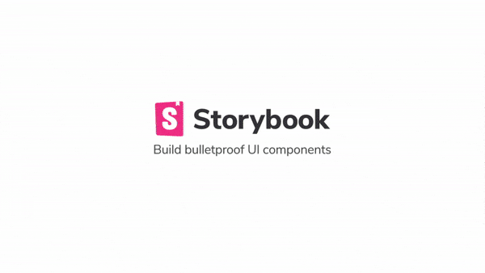

# Storybook brand

This repository contains Storybook brand assets. Feel free to use and customize these assets for your articles, talks, addons, websites, and anything else you can think of.

- [Logo](./logo)
- [Icon](./icon)
- [Badge](./badge)
- [Fonts](./fonts)
- [Colors](#fonts)
- [Presentation template](./presentation)
- [Illustrations](./illustrations)
- [Video](./video)

## Logo

| Version | Preview |
|---|---|
| Default |  |  
| Inverse |  (white text) |

## Icon

| Version | Preview |
|---|---|
| Default |  |  
| Inverse |  (white icon) |
| Monochrome |  |

## Badge

Share that your project uses Storybook by adding our badge to your readme or website.


```
<a href="https://github.com/storybooks/storybook" target="_blank"></a>
```


## Fonts
Storybook uses these fonts on the website and promotional materials.

| Font  |  Weights  |  Link |
|---|---|---|
| Nunito Sans  | 400 (normal), 600 (bold), 900 (black) | [Google fonts](https://fonts.google.com/specimen/Nunito+Sans), [Local](./fonts) |  
| Daniel   |  black |  [Dafont](https://www.dafont.com/daniel.font) |

**Note:** The Storybook UI includes the Nunito Sans webfont in the `font-family` declaration but *does not* require users to download it.

### Colors
| Color     | HEX value |
|------------|-----------|
| Coral       |   `#FF4785` |
| Ocean     |  `#006DEB` |
| Orange     |  `#FC521F` |
| Gold      |  `#FFAE00` |
| Green       |  `#66BF3C` |
| Seafoam      |  `#37D5D3` |
| Purple      |  `#6F2CAC` |
| Ultraviolet      |  `#2A0481` |


| Monochrome  | HEX value |
|------------|-----------|
| Darkest       |  `#2E3338` |
| Darker     |  `#454C54` |
| Dark     |  `#5C6570` |
| Mediumdark      |  `#737F8C` |
| Medium       |  `#D9E5F2` |
| Mediumlight      |  `#ECF2F9` |
| Light      |  `#EEF2F6` |
| Lighter      |  `#F6F9FC` |
| Lightest      |  `#FFFFFF` |

## Presentation template
Share Storybook at work, meetups, and conferences. Get a head start on your slides with our ready-to-use presentation (Keynote, PDF).

[**View presentation**](./presentation)

## Illustrations
Custom illustrations are located in [/illustrations](./illustrations).
For illustrations used on the website go to [storybooks/frontpage](https://github.com/storybooks/frontpage/).

## Video
The intro video, source files, and assets are located in [/video](./video).



#### Thanks
- [Sacha Grief](https://github.com/SachaG) the awesome designer of the 2017 logo (which inspired the current logo and icon)
- [Daniel Egerev](https://twitter.com/iDanb0) the amazing video animator
